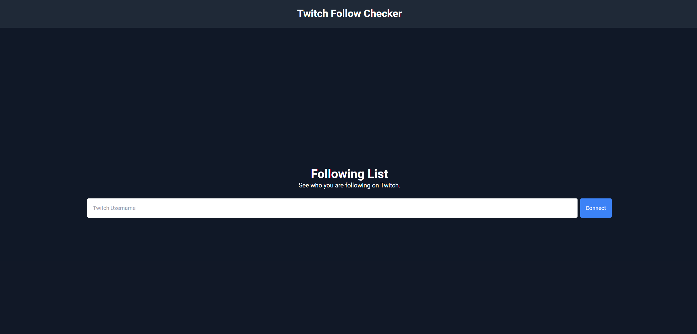

# Workflow CI/CD d'une app Python déployé sur AWS

App python pour générer la liste des streamers suivis pour un utilisateur Twitch.

Cette liste est ensuite stockée dans une BDD PostgreSQL.

- Stack technique : Python, Gitlab, Docker, Packer, Cloudformation
- Cloud provider : AWS
- Database : PostgreSQL (RDS)



## Lancement de l'app localement

Environment variables :

- CLIENT_ID = 'your-client-id'
- CLIENT_SECRET = 'your-client-secret'

Lancement de l'app

```bash
docker compose up -d
```

Database

```bash
docker compose exec  db psql -U postgres -d followchecker
\dt
SELECT * from followed_streamer;
```


<https://dev.twitch.tv/console/>

## Déploiement vers AWS

- Tests effectué pour validation : Packer + Cloudformation
- Utilisation de Packer + script bash pour builder une AMI
- Déploiement via Cloudformation en utilisant l'AMI précédemment créée
- *Services AWS utilisés : EC2, RDS, ALB, ASG, ACM, Route53*

## To improve

- Ajout des tests unitaires
- Déduplication database
